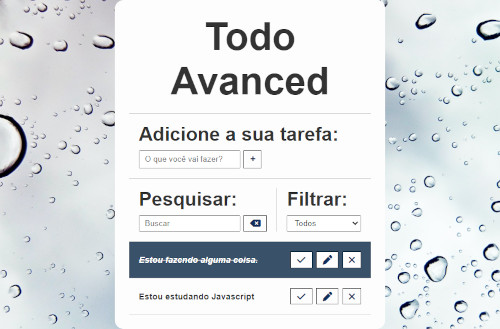

# Todo Avanced

> Hora de Codar

Projeto Todo, desenvolvido com javascript, HTML e CSS, focado em amarzenar itens inseridos pelo usuário, projeto ministrado pelo Matheus Battisti no canal hora de codar.

[Clique aui para acessar:](https://thiago-santos-sousa.github.io/Todo-Avanced/)

## 	Tecnologias

-Javascript
-HTML
-CSS
-Git e Github

## 	Contato

tthiagnho@gmail.com
